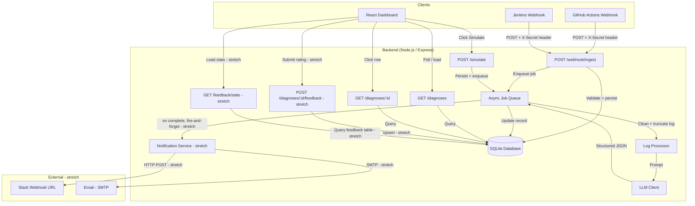
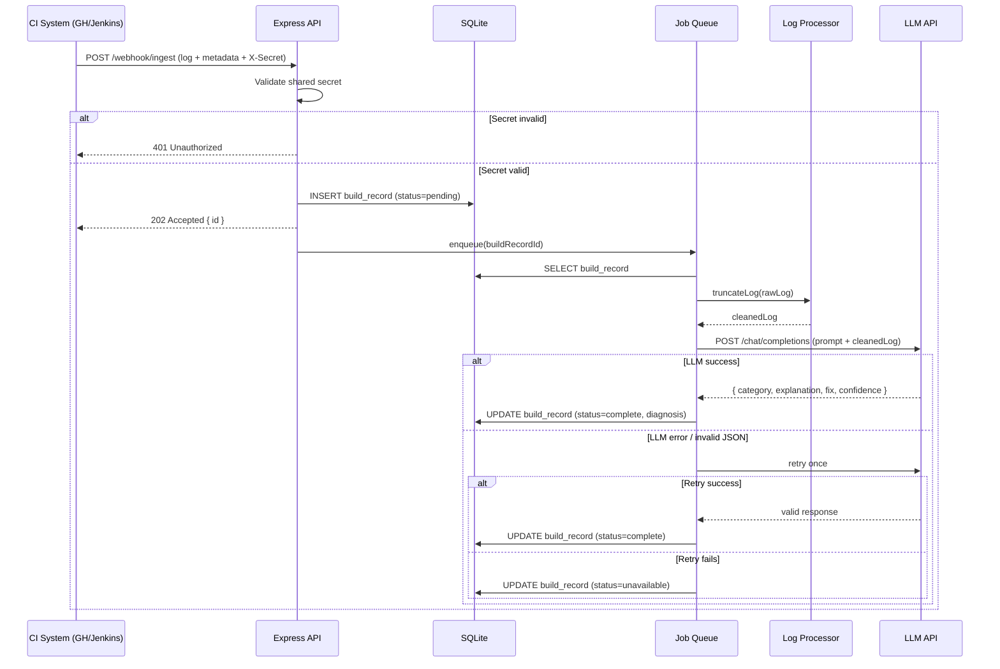
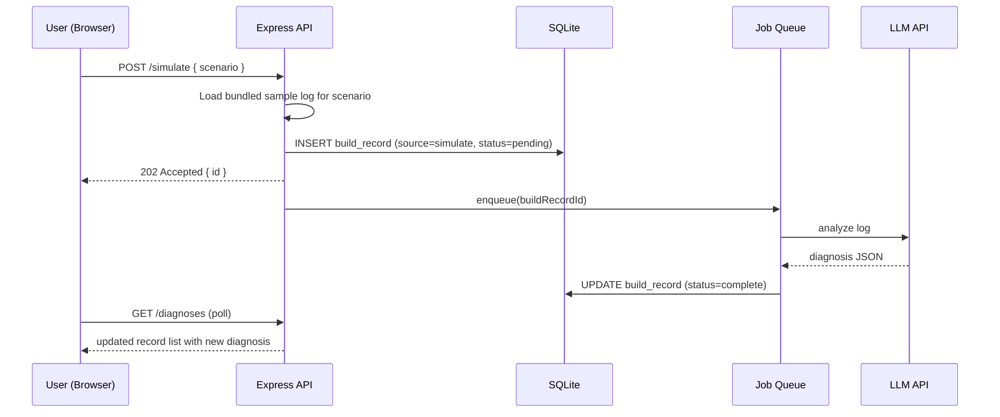
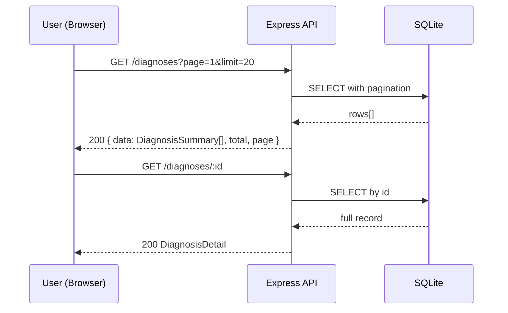

# Design Document: CI/CD Failure Doctor

## Overview

CI/CD Failure Doctor is a web application that automatically receives failed build logs from GitHub Actions or Jenkins (via webhook), analyzes them using an LLM, and presents developers with a plain-English root-cause diagnosis and a concrete suggested fix — eliminating the need to manually scroll through noisy pipeline output.

The system is designed for hackathon-speed delivery: a Node.js/Express backend handles webhook ingestion and async LLM analysis, a React frontend provides a real-time diagnosis dashboard, and SQLite stores all build records. The entire stack is deployable on free-tier platforms (Render, Railway, Vercel) with no cloud-infrastructure dependency. A first-class "Simulate Failed Build" path ensures the app is fully demoable without a live CI connection.

The MVP prioritizes a reliable, end-to-end demoable workflow. Stretch features (Slack/email notifications, helpfulness feedback) are isolated and clearly separated so they can be added without touching core paths.

---

## Architecture



---

## Sequence Diagrams

### Webhook Ingestion Flow



### Simulate Build Flow



### Dashboard Load Flow



---

## Components and Interfaces

### Component 1: Webhook Ingestion Handler

**Purpose**: Receives POST requests from GitHub Actions or Jenkins, validates the shared-secret header, persists a pending build record, and enqueues the record for async analysis. Responds within ~200 ms.

**Interface**:
```typescript
// POST /webhook/ingest
interface WebhookPayload {
  log: string;               // raw build log text
  repoName: string;          // e.g. "org/my-repo"
  jobName: string;           // workflow/job name
  commitSha: string;         // 40-char hex
  source: "github" | "jenkins";
  branch?: string;
}

interface WebhookResponse {
  id: string;                // UUID of the created build record
  status: "pending";
}
```

**Responsibilities**:
- Validate `X-Webhook-Secret` header against `WEBHOOK_SECRET` env var
- Reject payloads missing required fields (400)
- Reject requests whose total payload exceeds 10 MB — Express body parser is configured with a 10 MB limit; the handler returns HTTP 413 with body `{ error: "Payload too large" }` (Req 1.6)
- Persist a `BuildRecord` with `status = "pending"`
- Enqueue async diagnosis job and return 202 immediately
- Never wait for LLM result before responding

---

### Component 2: Simulate Build Handler

**Purpose**: Provides a first-class demo path. Accepts an optional scenario name, loads a bundled sample log, and runs it through the same ingestion + diagnosis pipeline as a real webhook.

**Interface**:
```typescript
// POST /simulate
interface SimulateRequest {
  scenario?: SimulationScenario;  // defaults to "test-failure"
}

type SimulationScenario =
  | "test-failure"
  | "dependency-error"
  | "docker-build-failure"
  | "env-var-missing"
  | "timeout"
  | "lint-error";

interface SimulateResponse {
  id: string;
  scenario: SimulationScenario;
  status: "pending";
}
```

**Responsibilities**:
- Map scenario to a bundled sample log file in `/fixtures/`
- Inject synthetic metadata (repo name, job name, commit SHA)
- Call the same `ingestBuild()` service function used by the real webhook
- Return 202 with record ID so the UI can poll for results

---

### Component 3: Async Job Queue

**Purpose**: Processes build records off the request path. Pulls pending records, runs log processing, calls the LLM, and updates the database record with the diagnosis or an unavailable state.

**Interface**:
```typescript
interface DiagnosisJob {
  buildRecordId: string;
}

interface JobProcessor {
  enqueue(job: DiagnosisJob): void;
  process(job: DiagnosisJob): Promise<void>;
}
```

**Responsibilities**:
- Maintain an in-process queue (using `p-queue` or a simple async FIFO for MVP)
- Fetch the full `BuildRecord` from the database
- Pass raw log to `LogProcessor.truncate()`
- Call `LLMClient.diagnose()` with the cleaned log + metadata
- On success: update record to `status = "complete"` with diagnosis fields
- After a successful update to `"complete"`: fire-and-forget call to `NotificationService.notify(record, diagnosisResult)` — this call is NOT awaited in a way that blocks or affects `BuildRecord.status`; if `notify()` throws, the error is caught and logged and the `BuildRecord` is unaffected (Req 12.3)
- On LLM error: retry once with exponential backoff
- On second failure: update record to `status = "unavailable"`
- Enforce a 120-second SLA per job: if `processJob` has not reached a terminal status within 120 seconds of being dequeued, a watchdog mechanism forces the record to `status = "unavailable"` with `errorMessage = "Diagnosis SLA timeout: exceeded 120 s"` and `completedAt = now()` (Req 3.5)
- Emit status updates so SSE/polling endpoints reflect current state

---

### Component 4: Log Processor

**Purpose**: Cleans and intelligently truncates raw build logs before sending to the LLM, controlling token cost and staying within context limits.

**Interface**:
```typescript
interface LogProcessor {
  truncate(rawLog: string, options?: TruncateOptions): string;
}

interface TruncateOptions {
  maxLines?: number;          // default 300
  tailLines?: number;         // default 200 — always keep last N lines
  keywordLines?: number;      // default 100 — lines matching error keywords
  keywords?: string[];        // default: ["error", "fail", "exception", "fatal", "warning"]
}

interface TruncateResult {
  cleanedLog: string;
  originalLineCount: number;
  truncated: boolean;
}
```

**Responsibilities**:
- Strip ANSI escape codes and terminal control sequences
- Always retain the final `tailLines` lines (most recent output)
- Collect up to `keywordLines` additional lines that match error keywords
- Deduplicate and sort collected lines by original line number
- Prefix output with a truncation notice when log was shortened
- Return result within a synchronous call (no I/O)

---

### Component 5: LLM Client

**Purpose**: Sends a structured prompt to the configured LLM API and parses the JSON diagnosis response.

**Interface**:
```typescript
interface LLMClient {
  diagnose(input: DiagnosisInput): Promise<DiagnosisResult>;
}

interface DiagnosisInput {
  cleanedLog: string;
  repoName: string;
  jobName: string;
  source: "github" | "jenkins" | "simulate";
}

interface DiagnosisResult {
  category: FailureCategory;
  explanation: string;       // plain-English, 2–5 sentences
  suggestedFix: string;      // markdown — may include code/config snippet
  confidence: "high" | "medium" | "low";
}

type FailureCategory =
  | "dependency-build-error"
  | "test-failure"
  | "docker-build-failure"
  | "env-var-secrets"
  | "timeout-infrastructure"
  | "syntax-lint-error"
  | "unknown";
```

**Responsibilities**:
- Construct a system prompt that instructs the LLM to return only valid JSON
- Inject `cleanedLog` and metadata into the user message
- Parse and validate the response against the `DiagnosisResult` schema
- Throw a typed `LLMParseError` when response is not valid JSON or missing required fields
- Let the caller (Job Queue) handle retry logic

---

### Component 6: Diagnoses API

**Purpose**: Serves the React dashboard with paginated lists and full detail records.

**Interface**:
```typescript
// GET /diagnoses?page=1&limit=20&category=test-failure
interface DiagnosisListResponse {
  data: DiagnosisSummary[];
  total: number;
  page: number;
  pageSize: number;
}

interface DiagnosisSummary {
  id: string;
  repoName: string;
  jobName: string;
  commitSha: string;
  source: "github" | "jenkins" | "simulate";
  status: BuildStatus;
  category: FailureCategory | null;
  explanation: string | null;   // first sentence only
  confidence: string | null;
  createdAt: string;            // ISO 8601
  completedAt: string | null;
}

// GET /diagnoses/:id
interface DiagnosisDetail extends DiagnosisSummary {
  suggestedFix: string | null;  // full markdown
  rawLog: string;
  truncated: boolean;
}

type BuildStatus = "pending" | "complete" | "unavailable";
```

**Responsibilities**:
- Serve paginated `DiagnosisSummary` lists via `GET /diagnoses` with `page`, `limit` (default 20, max 100), and `category` filter params
- Sort results by `createdAt` descending by default
- If `page` refers to a page beyond the total record count, return HTTP 200 with an empty `data` array and the correct `total` (not an error) (Req 7.6)
- If `category` is provided with a value outside the valid `FailureCategory` set, return HTTP 400 (Req 7.7)
- Serve full `DiagnosisDetail` (including `suggestedFix`, `rawLog`, `truncated`) via `GET /diagnoses/:id`; return HTTP 404 for unknown IDs

---

### Component 7: React Dashboard

**Purpose**: Displays the list of recent diagnoses, provides the Simulate button, and shows full detail views.

**Responsibilities**:
- Poll `GET /diagnoses` every 3 seconds to surface new results
- Show status badge (pending / complete / unavailable) per row
- Render `Simulate Failed Build` button with scenario selector dropdown
- Navigate to detail view on row click
- Render `suggestedFix` as formatted Markdown (using `react-markdown`)
- Display collapsible raw log section in detail view
- Show failure category as a color-coded badge
- When the detail view is opened for a record with `status = "pending"` or `status = "unavailable"`, display clear placeholder text (e.g. "Diagnosis in progress…" or "Diagnosis could not be generated") instead of blank or null field values (Req 8.9)
- When a `GET /diagnoses` poll request fails (network error or non-2xx), retain the currently displayed list and show a small non-blocking error indicator (e.g. a toast or inline banner); do not clear the list or crash (Req 8.10)

---

### Component 8: Notification Service (stretch)

> **Stretch Feature**: Only active when `SLACK_WEBHOOK_URL` or `NOTIFICATION_EMAIL` environment variables are set.

**Purpose**: Sends Slack and/or email notifications when a BuildRecord transitions to `status = "complete"`. Runs in parallel with the job queue response and never blocks it.

**Interface**:
```typescript
interface NotificationService {
  notify(record: BuildRecord, result: DiagnosisResult): Promise<void>;
}

interface NotificationPayload {
  category: FailureCategory;
  explanationExcerpt: string;   // first sentence of explanation
  detailUrl: string;            // APP_BASE_URL + "/diagnoses/" + record.id
}
```

**Responsibilities**:
- Extract first sentence of `explanation` as `explanationExcerpt`
- Build `detailUrl` from `APP_BASE_URL` env var + `/diagnoses/` + `record.id`
- IF `SLACK_WEBHOOK_URL` is set and non-empty: POST `{ text: "..." }` to that URL with the category, excerpt, and link
- IF `NOTIFICATION_EMAIL` is set and non-empty: send email with the same content via `nodemailer`
- On network error or non-2xx response from either channel: log the error and return — do NOT retry, do NOT throw (Req 12.3)
- Both channels run independently; failure of one does not prevent the other

---

### Component 9: Helpfulness Feedback (stretch)

> **Stretch Feature**: Provides anonymous per-diagnosis ratings. Requires no authentication; client identity is a UUID generated and persisted in browser `localStorage`.

**Purpose**: Allows users to rate diagnoses as helpful or unhelpful. Uses an anonymous client-generated identifier since the app has no authentication system.

> **Design Decision — Anonymous Client Identity**: The application has no user authentication anywhere in the spec. Requirement 13.2 calls for "one feedback record per diagnosis per user". This is implemented using a random UUID generated by the Dashboard on first load and persisted in `localStorage` as `cicd-doctor-client-id`. This UUID is sent as an `X-Client-Id` header on all feedback requests. This approach provides session-level deduplication without requiring login. It is not cryptographically secure — a user can reset their ID by clearing localStorage — but is sufficient for the hackathon use case.

**Interface**:
```typescript
// POST /diagnoses/:id/feedback
interface FeedbackRequest {
  rating: "helpful" | "unhelpful";
}
// Header: X-Client-Id: <uuid>

interface FeedbackResponse {
  id: string;           // feedback record UUID
  buildRecordId: string;
  clientId: string;
  rating: "helpful" | "unhelpful";
  createdAt: string;    // ISO 8601
}

// GET /feedback/stats
interface FeedbackStatsResponse {
  stats: FailureCategoryStats[];
}

interface FailureCategoryStats {
  category: FailureCategory;
  helpful: number;
  unhelpful: number;
}
```

**Responsibilities**:
- `POST /diagnoses/:id/feedback`: validate `rating` is exactly `"helpful"` or `"unhelpful"`; reject any other value with HTTP 400 and a clear error message (Req 13.4); validate `X-Client-Id` header is present and non-empty (HTTP 400 if absent); upsert into `feedback` table keyed on `(build_record_id, client_id)`, replacing any prior rating from that client for that diagnosis (Req 13.2)
- `GET /feedback/stats`: return counts per `FailureCategory`; return `{ helpful: 0, unhelpful: 0 }` for categories with no ratings (Req 13.3)
- Dashboard: on detail view open, fetch existing rating for the current `clientId` and show the matching button as selected (Req 13.1)

---

## Data Models

### BuildRecord

```typescript
interface BuildRecord {
  id: string;                    // UUID v4
  repoName: string;
  jobName: string;
  commitSha: string;
  branch: string | null;
  source: "github" | "jenkins" | "simulate";
  rawLog: string;
  cleanedLog: string | null;
  truncated: boolean;
  status: BuildStatus;
  category: FailureCategory | null;
  explanation: string | null;
  suggestedFix: string | null;
  confidence: "high" | "medium" | "low" | null;
  retryCount: number;            // 0 or 1
  errorMessage: string | null;   // internal error if status=unavailable
  createdAt: Date;
  completedAt: Date | null;
}
```

**SQLite DDL**:
```sql
CREATE TABLE build_records (
  id           TEXT PRIMARY KEY,
  repo_name    TEXT NOT NULL,
  job_name     TEXT NOT NULL,
  commit_sha   TEXT NOT NULL,
  branch       TEXT,
  source       TEXT NOT NULL CHECK(source IN ('github','jenkins','simulate')),
  raw_log      TEXT NOT NULL,
  cleaned_log  TEXT,
  truncated    INTEGER NOT NULL DEFAULT 0,
  status       TEXT NOT NULL DEFAULT 'pending'
                 CHECK(status IN ('pending','complete','unavailable')),
  category     TEXT,
  explanation  TEXT,
  suggested_fix TEXT,
  confidence   TEXT CHECK(confidence IN ('high','medium','low')),
  retry_count  INTEGER NOT NULL DEFAULT 0,
  error_message TEXT,
  created_at   TEXT NOT NULL,
  completed_at TEXT
);

CREATE INDEX idx_build_records_status    ON build_records(status);
CREATE INDEX idx_build_records_created   ON build_records(created_at DESC);
CREATE INDEX idx_build_records_category  ON build_records(category);
```

**Validation Rules**:
- `id` is a UUID v4 generated at insert time
- `commitSha` must be a 40-character hex string (SHA-1) or a 64-character hex string (SHA-256)
- `source` must be one of the three allowed values
- `retryCount` ≤ 1 (max one retry)
- `completedAt` is set only when `status` transitions from `pending`

---

### SimulationFixture

```typescript
interface SimulationFixture {
  scenario: SimulationScenario;
  repoName: string;
  jobName: string;
  commitSha: string;
  branch: string;
  rawLog: string;
}
```

Fixtures are static JSON/text files in `/backend/fixtures/` — one per scenario. They are bundled with the application and never stored in the database.

---

### FeedbackRecord (stretch)

> **Stretch Feature**: Only present when the helpfulness feedback feature is enabled.

```typescript
interface FeedbackRecord {
  id: string;               // UUID v4
  buildRecordId: string;    // FK → build_records.id
  clientId: string;         // anonymous UUID from localStorage
  rating: "helpful" | "unhelpful";
  createdAt: Date;
}
```

**SQLite DDL**:
```sql
CREATE TABLE feedback (
  id              TEXT PRIMARY KEY,
  build_record_id TEXT NOT NULL REFERENCES build_records(id),
  client_id       TEXT NOT NULL,
  rating          TEXT NOT NULL CHECK(rating IN ('helpful','unhelpful')),
  created_at      TEXT NOT NULL,
  UNIQUE(build_record_id, client_id)   -- enforces one rating per client per diagnosis; upsert replaces
);

CREATE INDEX idx_feedback_build_record ON feedback(build_record_id);
CREATE INDEX idx_feedback_category     ON feedback(build_record_id);  -- used by stats query via JOIN
```

**Validation Rules**:
- `id` is a UUID v4 generated at insert time
- `buildRecordId` must reference an existing row in `build_records`
- `rating` must be exactly `"helpful"` or `"unhelpful"`
- The `UNIQUE(build_record_id, client_id)` constraint enforces one-rating-per-client-per-diagnosis; upsert (INSERT OR REPLACE) replaces any prior rating

---

## Algorithmic Pseudocode

### Main Ingestion Algorithm

```pascal
PROCEDURE ingestBuild(payload, source)
  INPUT: payload (WebhookPayload | SimulateRequest), source string
  OUTPUT: BuildRecord with status=pending

  SEQUENCE
    // Validate
    IF NOT isValidPayload(payload) THEN
      RAISE ValidationError("Missing required fields")
    END IF

    // Persist
    record ← BuildRecord.create({
      id: generateUUID(),
      repoName: payload.repoName,
      jobName: payload.jobName,
      commitSha: payload.commitSha,
      source: source,
      rawLog: payload.log,
      status: "pending",
      createdAt: now()
    })
    db.save(record)

    // Enqueue (non-blocking)
    jobQueue.enqueue({ buildRecordId: record.id })

    RETURN record
  END SEQUENCE
END PROCEDURE
```

**Preconditions**:
- `payload` contains non-empty `log`, `repoName`, `jobName`, `commitSha`
- `source` is one of `"github"`, `"jenkins"`, `"simulate"`

**Postconditions**:
- A `BuildRecord` with `status = "pending"` exists in the database
- A job has been enqueued; the procedure returns before the job executes
- The returned record ID can be used to poll for diagnosis results

---

### Log Truncation Algorithm

```pascal
PROCEDURE truncateLog(rawLog, options)
  INPUT: rawLog string, options TruncateOptions
  OUTPUT: TruncateResult

  SEQUENCE
    lines ← splitByNewline(rawLog)
    
    IF length(lines) <= options.maxLines THEN
      RETURN { cleanedLog: stripAnsi(rawLog), originalLineCount: length(lines), truncated: false }
    END IF

    // Phase 1: collect tail lines
    tailSet ← last(lines, options.tailLines)  // preserves order

    // Phase 2: collect keyword lines
    keywordSet ← empty set
    FOR i ← 0 TO length(lines) - 1 DO
      // Loop Invariant: |keywordSet| <= options.keywordLines
      IF matchesAnyKeyword(lines[i], options.keywords) THEN
        keywordSet.add({ lineNumber: i, text: lines[i] })
        IF |keywordSet| >= options.keywordLines THEN
          BREAK
        END IF
      END IF
    END FOR

    // Phase 3: two-block output — keyword-only lines first, then tail lines (Req 4.6)
    keywordOnlySet ← keywordSet minus any entries whose lineNumber appears in tailSet
    keywordOnlyLines ← sortByLineNumber(keywordOnlySet)   // sorted by original line number
    cleanedKeywordLines ← stripAnsi(keywordOnlyLines.map(entry => entry.text))
    cleanedTailLines ← stripAnsi(tailSet.map(entry => entry.text))  // tailSet already in original order

    retainedCount ← length(cleanedKeywordLines) + length(cleanedTailLines)
    notice ← "[Log truncated: showing " + retainedCount + " of " + length(lines) + " lines]"
    cleanedLog ← notice + NEWLINE + join(cleanedKeywordLines, NEWLINE) + NEWLINE + join(cleanedTailLines, NEWLINE)

    RETURN { cleanedLog, originalLineCount: length(lines), truncated: true }
  END SEQUENCE
END PROCEDURE
```

**Preconditions**:
- `rawLog` is a non-null string (may be empty)
- `options.tailLines + options.keywordLines <= options.maxLines`

**Postconditions**:
- Result `cleanedLog` contains no ANSI escape sequences
- If `truncated = false`, `cleanedLog` is equivalent to `stripAnsi(rawLog)`
- If `truncated = true`, `cleanedLog` begins with a truncation notice, followed by a keyword-only block (lines not in `tailSet`, sorted by original line number), then the tail block (last N lines in original order)
- `|cleanedLog lines| <= options.maxLines + 1` (header + at most maxLines content lines)

**Loop Invariant**: At the start of each iteration, `|keywordSet|` ≤ `options.keywordLines`

---

### LLM Diagnosis Algorithm

```pascal
PROCEDURE diagnoseBuild(input)
  INPUT: input DiagnosisInput
  OUTPUT: DiagnosisResult

  SEQUENCE
    prompt ← buildSystemPrompt()
    userMessage ← buildUserMessage(input.cleanedLog, input.repoName, input.jobName)

    response ← llmAPI.complete({
      model: LLM_MODEL,
      messages: [
        { role: "system", content: prompt },
        { role: "user",   content: userMessage }
      ],
      temperature: 0,
      response_format: { type: "json_object" }
    })

    raw ← response.choices[0].message.content
    parsed ← JSON.parse(raw)

    IF NOT isValidDiagnosisResult(parsed) THEN
      RAISE LLMParseError("Response missing required fields", raw)
    END IF

    RETURN parsed AS DiagnosisResult
  END SEQUENCE
END PROCEDURE

PROCEDURE buildSystemPrompt()
  OUTPUT: string

  RETURN """
You are a CI/CD failure analysis expert. Analyze the provided build log and
return ONLY a JSON object with these fields:
{
  "category": one of [dependency-build-error, test-failure, docker-build-failure,
                       env-var-secrets, timeout-infrastructure, syntax-lint-error, unknown],
  "explanation": "2-5 sentence plain-English root cause",
  "suggestedFix": "markdown string with concrete fix steps and corrected code/config where relevant",
  "confidence": one of [high, medium, low]
}
Do not include any text outside the JSON object.
"""
END PROCEDURE
```

**Preconditions**:
- `input.cleanedLog` is non-empty
- `LLM_MODEL` and `LLM_API_KEY` environment variables are set

**Postconditions**:
- Returns a `DiagnosisResult` that passes `isValidDiagnosisResult()` schema check
- Throws `LLMParseError` if response cannot be parsed or validated

---

### Job Processing Algorithm (with Retry)

```pascal
PROCEDURE processJob(job)
  INPUT: job DiagnosisJob
  OUTPUT: void (side effect: updates BuildRecord in DB)

  SEQUENCE
    record ← db.findById(job.buildRecordId)
    IF record IS NULL THEN
      LOG "Record not found, skipping job"
      RETURN
    END IF

    truncateResult ← truncateLog(record.rawLog)
    db.update(record.id, { cleanedLog: truncateResult.cleanedLog, truncated: truncateResult.truncated })

    attempt ← 0
    WHILE attempt < MAX_RETRIES DO  // MAX_RETRIES = 2 (initial + 1 retry)
      // Loop Invariant: attempt <= MAX_RETRIES AND record.status = "pending"
      TRY
        result ← diagnoseBuild({
          cleanedLog: truncateResult.cleanedLog,
          repoName: record.repoName,
          jobName: record.jobName,
          source: record.source
        })
        db.update(record.id, {
          status: "complete",
          category: result.category,
          explanation: result.explanation,
          suggestedFix: result.suggestedFix,
          confidence: result.confidence,
          retryCount: attempt,
          completedAt: now()
        })
        // Fire-and-forget notification (stretch) — never blocks job completion
        TRY
          notificationService.notify(record, result)  // async, not awaited to completion
        CATCH NotificationError AS notifErr
          LOG "Notification failed: " + notifErr.message
        END TRY
        RETURN
      CATCH LLMParseError, NetworkError AS err
        attempt ← attempt + 1
        IF attempt < MAX_RETRIES THEN
          WAIT exponentialBackoff(attempt)  // 1s, then 2s
        END IF
      END TRY
    END WHILE

    // All attempts exhausted
    db.update(record.id, {
      status: "unavailable",
      retryCount: MAX_RETRIES - 1,
      errorMessage: err.message,
      completedAt: now()
    })
  END SEQUENCE
END PROCEDURE
```

**Preconditions**:
- `job.buildRecordId` refers to an existing `BuildRecord` with `status = "pending"`
- `MAX_RETRIES = 2`

**Postconditions**:
- `BuildRecord.status` is either `"complete"` or `"unavailable"` (never stays `"pending"`)
- If `"complete"`: all diagnosis fields are populated and non-null
- If `"unavailable"`: `errorMessage` is set, diagnosis fields remain null
- `retryCount` reflects the number of attempts made (0 or 1)

**Loop Invariant**: At the start of each iteration, `attempt ≤ MAX_RETRIES` and `record.status = "pending"` in the database

---

### Webhook Authentication Algorithm

```pascal
PROCEDURE validateWebhookRequest(request)
  INPUT: request HttpRequest
  OUTPUT: { valid: boolean, statusCode: 401 | 500 | null }

  SEQUENCE
    // Defense-in-depth check: misconfigured server returns 500, not 401.
    // Req 11.2's startup check should prevent this in normal operation.
    expected ← env.WEBHOOK_SECRET
    IF expected IS NULL OR expected = "" THEN
      LOG ERROR "WEBHOOK_SECRET env var not configured — returning 500"
      RETURN { valid: false, statusCode: 500 }
    END IF

    secret ← request.headers["x-webhook-secret"]
    IF secret IS NULL OR secret = "" THEN
      RETURN { valid: false, statusCode: 401 }
    END IF

    // Constant-time comparison to prevent timing attacks
    IF timingSafeEqual(secret, expected) THEN
      RETURN { valid: true, statusCode: null }
    ELSE
      RETURN { valid: false, statusCode: 401 }
    END IF
  END SEQUENCE
END PROCEDURE
```

**Preconditions**:
- `WEBHOOK_SECRET` environment variable is set in the deployment environment

**Postconditions**:
- Returns `{ valid: true }` if and only if `WEBHOOK_SECRET` is configured and the header matches it
- Returns `{ valid: false, statusCode: 401 }` when the header is absent, empty, or mismatched and `WEBHOOK_SECRET` is configured
- Returns `{ valid: false, statusCode: 500 }` when `WEBHOOK_SECRET` is not set — server misconfiguration, not a client auth failure (Req 9.5)
- The value comparison always uses constant-time equality to prevent timing attacks

---

## Key Functions with Formal Specifications

### `ingestBuild(payload, source): Promise<BuildRecord>`

**Preconditions**:
- `payload.log.length > 0`
- `payload.repoName`, `payload.jobName`, `payload.commitSha` are non-empty strings
- `source ∈ {"github", "jenkins", "simulate"}`

**Postconditions**:
- A row exists in `build_records` with the returned `id`
- `status = "pending"` at return time
- A diagnosis job has been enqueued (not yet processed)
- Function returns in < 200 ms (no LLM call on this path)

---

### `truncateLog(rawLog, options?): TruncateResult`

**Preconditions**:
- `rawLog` is a string (may be empty)

**Postconditions**:
- `result.cleanedLog` contains no ANSI escape codes
- `result.originalLineCount = rawLog.split('\n').length`
- `result.truncated = (originalLineCount > options.maxLines)`
- If `truncated`, `result.cleanedLog.split('\n').length <= options.maxLines + 1` (header line)

---

### `diagnoseBuild(input): Promise<DiagnosisResult>`

**Preconditions**:
- `input.cleanedLog.length > 0`
- Environment variables `LLM_API_KEY` and `LLM_MODEL` are set

**Postconditions**:
- On success: returns object satisfying `isValidDiagnosisResult(result) = true`
- On failure: throws `LLMParseError` with the raw response attached

---

### `processJob(job): Promise<void>`

**Preconditions**:
- `job.buildRecordId` exists in `build_records` with `status = "pending"`

**Postconditions**:
- `build_records[job.buildRecordId].status ∈ {"complete", "unavailable"}`
- `build_records[job.buildRecordId].completed_at` is set
- If complete: `category`, `explanation`, `suggested_fix`, `confidence` are all non-null
- If `NotificationService` is configured, a notification is dispatched but its success/failure does not affect `BuildRecord.status`

---

### `notificationService.notify(record, result): Promise<void>` (stretch)

> **Stretch Feature**

**Preconditions**:
- `record.status = "complete"`
- `result.explanation` is a non-empty string

**Postconditions**:
- If `SLACK_WEBHOOK_URL` is set: an HTTP POST was attempted to that URL
- If `NOTIFICATION_EMAIL` is set: an email send was attempted to that address
- `record` is not modified under any outcome
- Function always resolves (never rejects); errors are caught and logged

---

### `feedbackService.upsertFeedback(buildRecordId, clientId, rating): Promise<FeedbackRecord>` (stretch)

> **Stretch Feature**

**Preconditions**:
- `buildRecordId` exists in `build_records`
- `clientId` is a non-empty string
- `rating ∈ {"helpful", "unhelpful"}`

**Postconditions**:
- Exactly one row exists in `feedback` with `(build_record_id = buildRecordId, client_id = clientId)`
- That row's `rating` equals the provided `rating` (prior value replaced if different)
- If `NotificationService` is configured, a notification is dispatched but its success/failure does not affect `BuildRecord.status`

---

## Example Usage

```typescript
// 1. Real webhook from GitHub Actions
// POST /webhook/ingest
// Headers: X-Webhook-Secret: mysecret
const webhookPayload = {
  log: "...long build output...",
  repoName: "acme/payments-service",
  jobName: "CI / build-and-test",
  commitSha: "a1b2c3d4e5f6a1b2c3d4e5f6a1b2c3d4e5f6a1b2",
  source: "github",
  branch: "feat/add-stripe"
};
// Response: 202 { id: "uuid-here", status: "pending" }

// 2. Simulate a failed build (demo path)
// POST /simulate
const simReq = { scenario: "test-failure" };
// Response: 202 { id: "uuid-here", scenario: "test-failure", status: "pending" }

// 3. Poll for results
// GET /diagnoses?page=1&limit=20
// Response includes rows with status progressing pending → complete|unavailable

// 4. Fetch full diagnosis detail
// GET /diagnoses/uuid-here
// Response:
const detail: DiagnosisDetail = {
  id: "uuid-here",
  repoName: "acme/payments-service",
  jobName: "CI / build-and-test",
  commitSha: "a1b2c3d4e5f6a1b2c3d4e5f6a1b2c3d4e5f6a1b2",
  source: "github",
  status: "complete",
  category: "test-failure",
  explanation: "3 unit tests in PaymentService failed due to a mocked Stripe client returning an unexpected error shape after the recent refactor. The tests expected `error.code` but the new client throws an object with `error.type`.",
  suggestedFix: "Update the mock in `__tests__/payment.test.ts`:\n```ts\njest.mock('../stripe', () => ({ charge: jest.fn().mockRejectedValue({ type: 'card_error', message: 'declined' }) }));\n```",
  confidence: "high",
  createdAt: "2024-01-15T10:23:45Z",
  completedAt: "2024-01-15T10:23:52Z",
  suggestedFix: "...",
  rawLog: "...",
  truncated: true
};

// 5. Submit helpfulness feedback (stretch)
// POST /diagnoses/uuid-here/feedback
// Headers: X-Client-Id: client-uuid-from-localstorage
const feedbackReq: FeedbackRequest = { rating: "helpful" };
// Response: 200 { id: "feedback-uuid", buildRecordId: "uuid-here", clientId: "...", rating: "helpful", createdAt: "..." }

// 6. Get feedback stats (stretch)
// GET /feedback/stats
// Response:
const stats: FeedbackStatsResponse = {
  stats: [
    { category: "test-failure",           helpful: 12, unhelpful: 2 },
    { category: "dependency-build-error", helpful: 8,  unhelpful: 1 },
    { category: "docker-build-failure",   helpful: 0,  unhelpful: 0 },
    // ... all 7 categories always present
  ]
};

// 7. Trigger notification (internal — called by job queue after status=complete)
// notificationService.notify(record, result)
// → POST https://hooks.slack.com/... { text: "[test-failure] 3 unit tests failed... https://myapp.com/diagnoses/uuid-here" }
// → sendEmail("dev@example.com", subject: "CI/CD Failure Diagnosed", body: "...")
```

---

## Correctness Properties

*A property is a characteristic or behavior that should hold true across all valid executions of a system — essentially, a formal statement about what the system should do. Properties serve as the bridge between human-readable specifications and machine-verifiable correctness guarantees.*

### Property 1: Webhook Non-Blocking

For all valid webhook requests, the HTTP response is returned before any LLM API call is initiated. Response time ≤ 2 seconds in all cases.

**Validates: Requirements 1.4**

### Property 2: Secret Validation Completeness

For all requests to `/webhook/ingest`, if the `X-Webhook-Secret` header is absent, empty, or does not match `WEBHOOK_SECRET`, the response status is 401 and no BuildRecord is persisted.

**Validates: Requirements 1.2, 9.3**

### Property 3: Diagnosis Termination

For all enqueued jobs, `processJob` terminates with the record's `status` set to either `"complete"` or `"unavailable"`. No record remains permanently `"pending"`.

**Validates: Requirements 3.1, 3.5**

### Property 4: Retry Bound

For all jobs that encounter LLM errors, the LLM is called at most 2 times (initial attempt + 1 retry). `retry_count ≤ 1` in all completed records.

**Validates: Requirements 6.4**

### Property 5: Log Truncation Safety

For all string inputs, `truncateLog` returns a result free of ANSI escape codes, and if the input exceeds `maxLines`, the output line count is ≤ `maxLines + 1` (the truncation header counts as one line).

**Validates: Requirements 4.1, 4.5**

### Property 6: Simulate Parity

For all simulation scenarios, the code path through `ingestBuild` and `processJob` is identical to the real webhook path. No separate LLM-skipping logic exists in simulate mode.

**Validates: Requirements 2.4**

### Property 7: Unavailable State Integrity

For all records with `status = "unavailable"`, `explanation`, `category`, `suggested_fix`, and `confidence` are null, and `error_message` is non-null.

**Validates: Requirements 6.3**

### Property 8: Schema Validity

For all records with `status = "complete"`, `category ∈ FailureCategory`, `confidence ∈ {"high","medium","low"}`, and `explanation` is a non-empty string.

**Validates: Requirements 5.4, 5.5**

### Property 9: LLM Response Parse Round-Trip

For any valid `DiagnosisResult` object, serializing it to JSON and passing it through `LLM_Client`'s parse-and-validate path produces an equivalent object. For any string that is not valid JSON or is missing required fields, the parse step throws `LLMParseError`.

**Validates: Requirements 5.2, 5.3**

### Property 10: Notification Non-Interference (stretch)

For all `processJob` executions, the `BuildRecord.status` and all diagnosis fields are set to their final values before `notificationService.notify()` is called, and the outcome of `notify()` (success or failure) does not modify any field of the `BuildRecord`.

**Validates: Requirements 12.3**

### Property 11: Feedback Upsert Idempotence (stretch)

For any `(buildRecordId, clientId)` pair, submitting N feedback requests with the same `rating` results in exactly one row in the `feedback` table. Submitting with a different `rating` replaces the prior rating, leaving exactly one row.

**Validates: Requirements 13.2**

---

### Property 12: Diagnosis SLA Bound

For all BuildRecords that enter the job queue, the record's `status` is set to either `"complete"` or `"unavailable"` within 120 seconds of being dequeued. No record remains in `status = "pending"` for longer than 120 seconds after its job begins processing.

**Validates: Requirements 3.5**

---

## Error Handling

### Scenario 1: Invalid Webhook Secret

**Condition**: `X-Webhook-Secret` header is missing, empty, or does not match `WEBHOOK_SECRET`
**Response**: `401 Unauthorized` with body `{ error: "Invalid or missing webhook secret" }`
**Recovery**: CI system receives 401 and logs the failure; no record is created

---

### Scenario 2: Malformed Webhook Payload

**Condition**: Required fields (`log`, `repoName`, `jobName`, `commitSha`) are missing or empty
**Response**: `400 Bad Request` with body `{ error: "Validation failed", details: string[] }`
**Recovery**: CI system receives 400; developer inspects webhook configuration

---

### Scenario 3: LLM Returns Invalid JSON

**Condition**: LLM response body is not parseable JSON or is missing required fields
**Response**: Job processor catches `LLMParseError`, waits 1 second, retries once
**Recovery**: If retry succeeds → `status = "complete"`; if retry fails → `status = "unavailable"` with `errorMessage` set; dashboard shows "Diagnosis unavailable" badge

---

### Scenario 4: LLM API Network Error / Timeout

**Condition**: LLM API call times out (> 30 seconds) or returns a 5xx status
**Response**: Job processor treats as retryable error, waits 2 seconds, retries once
**Recovery**: Same as Scenario 3

---

### Scenario 5: Database Write Failure

**Condition**: SQLite write fails (disk full, locked file)
**Response**: Server logs the error; if during ingest → returns `500` to caller; if during job processing → job silently fails (record stays `pending`)
**Recovery**: Admin restarts service; pending records are re-queued on startup (stretch)

---

### Scenario 6: Very Large Log

**Condition**: Incoming log is > 100,000 lines
**Response**: `truncateLog` reduces to `maxLines` (300) before any LLM call
**Recovery**: Truncation notice prepended to cleaned log; `truncated = true` shown in UI

---

### Scenario 7: Notification Delivery Failure (stretch)

**Condition**: HTTP POST to `SLACK_WEBHOOK_URL` returns a non-2xx status, or SMTP send to `NOTIFICATION_EMAIL` throws a network error
**Response**: `NotificationService` catches the error, logs the message, and returns without retrying
**Recovery**: `BuildRecord.status` remains `"complete"`; the diagnosis is still visible on the dashboard. The failure is surfaced only in server logs.

---

### Scenario 8: Invalid Feedback Rating (stretch)

**Condition**: `POST /diagnoses/:id/feedback` body contains a `rating` value other than `"helpful"` or `"unhelpful"`, or the `X-Client-Id` header is absent or empty
**Response**: `400 Bad Request` with body `{ error: "Invalid rating value" }` or `{ error: "Missing X-Client-Id header" }` respectively; no row is written to the `feedback` table
**Recovery**: Dashboard displays an error toast; user can retry with a valid value

---

### Scenario 9: Payload Too Large

**Condition**: The total `POST /webhook/ingest` request body exceeds the 10 MB Express body parser limit
**Response**: Express rejects the request before the route handler runs; the handler returns `413 Payload Too Large` with body `{ error: "Payload too large" }`
**Recovery**: CI system receives 413; developer should check whether the raw log is being sent in full (consider pre-truncating on the sender side before posting) and retry with a smaller payload

---

## Testing Strategy

### Unit Testing Approach

Use **Vitest** (or Jest) for all unit tests. Target 80%+ line coverage on backend service modules.

Key unit test areas:
- `LogProcessor.truncate()`: empty string, under-limit log, over-limit log, ANSI-heavy log, log with no keyword matches
- `LLMClient.diagnose()`: valid JSON response, invalid JSON, missing fields, network timeout
- `validateWebhookRequest()`: missing header, wrong value, correct value, empty `WEBHOOK_SECRET`
- `ingestBuild()`: happy path, missing fields, database error
- `processJob()`: success on first attempt, success on retry, failure after both attempts

### Property-Based Testing Approach

Use **fast-check** for property-based tests on the log processing and parsing layers.

**Property Test Library**: fast-check

Properties to verify:
- `truncateLog(log)` result never exceeds `maxLines + 1` lines for any string input
- `truncateLog(log).cleanedLog` never contains ANSI sequences for any string input
- `isValidDiagnosisResult(parseJSON(buildSystemPrompt()))` — the prompt always produces parseable structure
- For any `log` with `length ≤ maxLines`, `truncated = false` always holds

### Integration Testing Approach

Use **Supertest** to test the full Express request/response cycle:
- POST `/webhook/ingest` with valid and invalid secrets
- POST `/simulate` with each scenario
- GET `/diagnoses` with pagination params
- GET `/diagnoses/:id` for existing and non-existing IDs
- End-to-end: simulate → poll → verify `status = "complete"` (using a mock LLM client)

---

## Performance Considerations

- **Webhook response time**: The ingestion handler must respond within ~2 seconds. All LLM work happens off the request path via the job queue.
- **Log truncation**: `truncateLog` is synchronous and O(n) in log line count. For worst-case 100k-line logs this is ~10 ms — acceptable.
- **Job queue throughput**: For an MVP solo project, a simple in-process queue with concurrency = 2 is sufficient. LLM calls take 3–10 seconds each; at 2 concurrent workers this handles burst load from demos.
- **Database**: SQLite with WAL mode handles concurrent reads well. The index on `created_at DESC` ensures the dashboard list query stays fast up to tens of thousands of records.
- **Frontend polling**: 3-second poll interval is a good MVP tradeoff. Can be replaced with Server-Sent Events post-hackathon.
- **Diagnosis SLA**: Each job must reach a terminal status within 120 seconds of being dequeued. A watchdog (timeout wrapper around the full `processJob` execution) enforces this bound and forces `status = "unavailable"` on expiry, ensuring the dashboard never shows a permanently spinning "pending" record (Req 3.5).

---

## Deployment Considerations

### Startup Validation

On server start, before binding to any port or accepting requests, the Backend checks that both `WEBHOOK_SECRET` and `LLM_API_KEY` are set and non-empty. If either variable is missing, the server logs a clear error identifying the missing variable and calls `process.exit(1)` rather than starting in a degraded state (Req 11.2):

```typescript
const REQUIRED_ENV = ["WEBHOOK_SECRET", "LLM_API_KEY"] as const;
for (const key of REQUIRED_ENV) {
  if (!process.env[key]) {
    console.error(`[startup] Missing required environment variable: ${key}`);
    process.exit(1);
  }
}
```

This prevents the server from silently accepting webhook requests and returning 500 due to a missing `WEBHOOK_SECRET`, or silently failing every diagnosis job due to a missing `LLM_API_KEY`. The runtime `validateWebhookRequest` 500-path (Edit 6) is a defense-in-depth fallback for the case where the env var is unset at runtime despite passing the startup check (e.g., hot-reload or env mutation).

### Free-Tier Cold Start Mitigation

Free-tier hosts (Render, Railway) spin down idle instances after ~15 minutes of inactivity. The first request after a cold start can take 30–60 seconds, which appears broken to a judge trying to demo the app.

**Mitigation**: A lightweight `GET /health` endpoint (returns `200 { status: "ok" }`) should be exposed and pinged every 10 minutes by an external uptime service (e.g. UptimeRobot free tier, cron-job.org) or a scheduled GitHub Actions workflow. This is especially important during the judging window.

### CI Trigger Snippets

These show the sender-side configuration that fires the webhook on a CI failure. The backend's `/webhook/ingest` endpoint is the receiver for both.

#### GitHub Actions

```yaml
# Add this step to any workflow job, after your build/test steps:
- name: Notify CI/CD Failure Doctor
  if: failure()
  run: |
    curl -s -X POST "${{ secrets.CICD_DOCTOR_URL }}/webhook/ingest" \
      -H "Content-Type: application/json" \
      -H "X-Webhook-Secret: ${{ secrets.CICD_DOCTOR_SECRET }}" \
      -d '{
        "log":       "'"$(cat build.log | tail -300)"'",
        "repoName":  "${{ github.repository }}",
        "jobName":   "${{ github.workflow }} / ${{ github.job }}",
        "commitSha": "${{ github.sha }}",
        "source":    "github",
        "branch":    "${{ github.ref_name }}"
      }'
```

#### Jenkins (Declarative Pipeline)

```groovy
post {
  failure {
    script {
      def log = currentBuild.rawBuild.getLog(300).join('\n')
      httpRequest(
        httpMode:        'POST',
        url:             "${env.CICD_DOCTOR_URL}/webhook/ingest",
        contentType:     'APPLICATION_JSON',
        customHeaders:   [[name: 'X-Webhook-Secret', value: env.CICD_DOCTOR_SECRET]],
        requestBody:     groovy.json.JsonOutput.toJson([
          log:       log,
          repoName:  env.JOB_NAME,
          jobName:   env.JOB_NAME,
          commitSha: env.GIT_COMMIT,
          source:    'jenkins'
        ])
      )
    }
  }
}
```

---

## Security Considerations

- **Webhook secret**: Compared with `crypto.timingSafeEqual` to prevent timing attacks. Documented in deployment README.
- **Log content**: Raw logs may contain secrets (env vars printed in error output). The application stores them in SQLite and displays them in the UI. For MVP, acceptable; production hardening would require log scrubbing.
- **LLM prompt injection**: The system prompt instructs the LLM to return only JSON. Log content is injected as a user message, not interpolated into the system prompt, reducing prompt injection risk.
- **Input size**: Maximum raw log size accepted via webhook is capped at 10 MB in the Express body parser config to prevent DoS.
- **WEBHOOK_SECRET** and **LLM_API_KEY** must be set as environment variables, never hardcoded.
- **CORS**: The frontend (Vercel) and backend (Render/Railway) run on different origins. Express must be configured with the `cors` package to explicitly allow the deployed frontend origin (e.g. `https://cicd-doctor.vercel.app`) and `http://localhost:5173` for local dev. A wildcard (`*`) must not be used, as it would allow any origin to POST to the webhook endpoint.
- **Rate limiting**: `/webhook/ingest` and `/simulate` are publicly reachable and can trigger LLM API calls. Per-IP rate limiting via `express-rate-limit` (e.g. 20 requests/minute per IP) must be applied to both endpoints to prevent quota exhaustion and abuse during the judging window.

---

## Dependencies

### Backend
| Package | Purpose |
|---|---|
| `express` | HTTP server and routing |
| `better-sqlite3` | SQLite ORM-free client (sync API, simpler for MVP) |
| `uuid` | UUID v4 generation |
| `p-queue` | In-process async job queue with concurrency control |
| `openai` | LLM API client (compatible with OpenAI and OpenAI-compatible endpoints) |
| `zod` | Runtime schema validation for LLM responses and webhook payloads |
| `strip-ansi` | Remove ANSI escape codes from log strings |
| `cors` | CORS middleware — restrict cross-origin requests to known frontend origins |
| `express-rate-limit` | Per-IP rate limiting on `/webhook/ingest` and `/simulate` |
| `nodemailer` | SMTP email sending for the stretch notification feature |

### Frontend
| Package | Purpose |
|---|---|
| `react` + `react-dom` | UI framework |
| `react-markdown` | Render `suggestedFix` markdown safely |
| `vite` | Build tool and dev server |

### Dev / Testing
| Package | Purpose |
|---|---|
| `vitest` | Test runner |
| `supertest` | HTTP integration test client |
| `fast-check` | Property-based testing |
| `typescript` | Type safety across the stack |

---

## Environment Variables

Complete reference for all environment variables used across the system. Copy this block to create a `.env` file for local development.

```env
# ── Required ──────────────────────────────────────────────────────────────────
WEBHOOK_SECRET=changeme          # Shared secret validated on every /webhook/ingest request
LLM_API_KEY=sk-...               # API key for the configured LLM provider

# ── LLM Configuration ─────────────────────────────────────────────────────────
LLM_MODEL=gpt-4o-mini            # Model name passed to the LLM API (default: gpt-4o-mini)

# ── Database ──────────────────────────────────────────────────────────────────
DATABASE_PATH=./data/cicd-doctor.db   # SQLite file path (default shown)

# ── Server ────────────────────────────────────────────────────────────────────
PORT=3000                        # Express listen port (default: 3000)

# ── Stretch: Notifications (optional) ─────────────────────────────────────────
SLACK_WEBHOOK_URL=               # If set, POST diagnosis summary to this Slack Incoming Webhook URL
NOTIFICATION_EMAIL=              # If set, send diagnosis summary email to this address
APP_BASE_URL=http://localhost:3000  # Base URL used to construct diagnosis detail links in notifications

# ── Stretch: CORS ─────────────────────────────────────────────────────────────
# Configure the allowed frontend origin in your Express cors() config:
# cors({ origin: ['https://your-app.vercel.app', 'http://localhost:5173'] })
```
